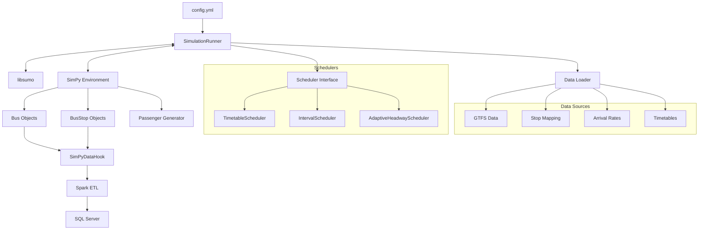

# York Region Transit Operations Simulation and Analysis Platform

This project is a high-fidelity bus system simulation platform built on SimPy and SUMO, specifically designed to simulate, analyze, and optimize bus operations in York Region. The system combines discrete-event simulation with microscopic traffic flow simulation, supports multiple scheduling strategies, enables precise passenger demand modeling, and writes simulation results directly to a SQL Server database for in-depth analysis.

## 📋 Table of Contents

- [✨ Core Features](#-core-features)
- [🏗️ System Architecture](#️-system-architecture)
- [📦 System Requirements](#-system-requirements)
- [🚀 Quick Start](#-quick-start)
- [⚙️ Configuration Details](#️-configuration-details)
- [🕹️ Running Simulations](#️-running-simulations)
- [📈 Scheduling Strategies](#-scheduling-strategies)
- [📊 Data Processing](#-data-processing)
- [📁 Project Structure](#-project-structure)
- [🔧 Tools & Scripts](#-tools--scripts)
- [📝 Documentation Index](#-documentation-index)
- [🔍 Troubleshooting](#-troubleshooting)
- [🤝 Contribution Guide](#-contribution-guide)

## ✨ Core Features

### Simulation Capabilities
- **Co-simulation**: Deep integration of SimPy's discrete-event simulation with SUMO's microscopic traffic flow simulation for a high-fidelity transit environment.
- **Multi-scenario Support**: Manages multiple bus routes (e.g., Route 601) simultaneously, supporting bi-directional operations (Northbound 601001, Southbound 601002).
- **Realistic Road Network**: Utilizes a real-world road network and stop layout built from OpenStreetMap and GTFS data.

### Scheduling Strategies
- **Timetable Scheduling** (`timetable`): Dispatches buses strictly according to a predefined timetable, suitable for fixed-schedule services.
- **Interval Scheduling** (`interval`): Dispatches buses at fixed time intervals, suitable for high-frequency services.
- **[Simplified Adaptive Headway Scheduling][[memory:677388226891081276]]** (`adaptive_headway`): Dynamically adjusts dispatch intervals based on real-time demand at specific monitoring stops.

### Data Management
- **[Real-time Data Collection][[memory:4069272448243752535]]**: Captures all simulation events, including arrivals, departures, and passenger boarding/alighting, via SimPyDataHook.
- **[Direct Database Writes][[memory:9110465707832797523]]**: Eliminates intermediate Parquet files by writing all data directly to `BusTrip` or `Baseline` tables in SQL Server.
- **Spark ETL Processing**: Uses PySpark for stream-based data processing and quality checks.

### Analysis Functions
- **[Multi-round Simulation][[memory:3396096264196668185]]**: Supports automated execution of multiple simulation rounds, each with a different random seed and date.
- **Baseline Comparison**: Allows saving specific configurations as a baseline (in the `Baseline` table) for easy evaluation of strategy optimization.
- **KPI Tracking**: Tracks key metrics in real-time, such as headway adjustments, demand forecasts, and load factors.

## 🏗️ System Architecture

The system features a modular design with the following core components:



### Key Component Descriptions

1.  **SimulationRunner** (`simulation/simulation_runner.py`): The core controller that coordinates the SimPy and SUMO engines.
2.  **[libsumo Integration][[memory:2714273344898249620]]**: Uses the `libsumo` interface to boost performance, avoiding the bottlenecks of `traci`.
3.  **[Scheduler Architecture][[memory:7656935818309238913]]**: A flexible scheduler interface design that supports various scheduling strategies.
4.  **[Data Hook][[memory:4069272448243752535]]**: An enhanced data collection system that supports comprehensive trip data logging.
5.  **[Bi-directional Stop Mapping][[memory:2071778652114265656]]**: Supports separate stop mapping configurations for northbound and southbound routes.

## 📦 System Requirements

### Base Environment
- **OS**: Windows 10/11, Linux, macOS
- **Python**: 3.9 or higher
- **Java**: JDK 8 or 11 (for Spark)
- **SUMO**: 1.10.0 or higher

### Database
- **SQL Server**: 2016 or higher
- **ODBC Driver**: 17 or 18 for SQL Server

### Python Dependencies
Key dependencies include:
```
simpy>=4.0.1
pyspark>=3.0.0
pyyaml>=5.4.1
pyodbc>=4.0.30
numpy>=1.21.0
pandas>=1.3.0
```
See `requirements.txt` for the full list.

## 🚀 Quick Start

### 1. Install Dependencies
```bash
# Clone the project
git clone <repository-url>
cd Simulation

# Install Python dependencies
pip install -r requirements.txt

# Install SUMO (Windows example)
# Download and install from https://sumo.dlr.de/docs/Downloads.php
```

### 2. Configure the Database
```bash
# Create the database and tables
python check_database.py

# Or run the SQL scripts manually
# config/create_tables.sql - Creates the BusTrip table
# config/create_baseline_table.sql - Creates the Baseline table
```

### 3. Configure the System
```bash
# Copy and edit the database configuration
cp config/db.yml.example config/db.yml
# Edit config/db.yml with your database connection details

# Review the main configuration file
# config.yml contains all simulation parameters
```

### 4. Run a Simulation
```bash
# Run a simple simulation (without ETL)
python run_simulation_simple.py

# Run a full simulation (with ETL and database writes)
python simulation/simulation_runner.py
```

## ⚙️ Configuration Details

### Main Configuration File (config.yml)

```yaml
# Simulation configuration
simulation:
  num_rounds: 1              # Number of simulation rounds
  start_time_seconds: 18000  # Start time (5:00 AM)
  end_time_seconds: 86400    # End time (24:00)
  random_seed: 34            # Random seed
  data_target: scenario      # Data target: scenario/baseline

# Scheduler configuration
simpy:
  scheduler:
    type: adaptive_headway   # Scheduler type
    adaptive_headway:
      beta_target: 1.0       # Target load factor
      bus_capacity: 75       # Vehicle capacity
      h_min: 600             # Minimum headway (seconds)
      h_max: 1800            # Maximum headway (seconds)
      max_hold: 30           # Maximum holding time (seconds)
      headway_tolerance: 0.2 # Headway tolerance

# Scenario configuration
scenarios:
  '601':
    name: Route 601 - York Region
    stop_id_mapping_file: data/601/stop_mapping.json
    target_route_id: '601'
```

### Database Configuration (config/db.yml)

```yaml
database:
  server: 'localhost'
  database: 'BusSim'
  driver: '{ODBC Driver 17 for SQL Server}'
  table: dbo.BusTrip
  batch_size: 5000

spark:
  app_name: BusTripETL
  master: local[*]
  driver_memory: 16g
  executor_memory: 16g
```

## 🕹️ Running Simulations

### Single-Round Simulation
The simplest way to run a simulation:
```bash
python run_simulation_simple.py
```

### Multi-Round Simulation
Modify `config.yml`:
```yaml
simulation:
  num_rounds: 10  # Run 10 rounds
```

### Baseline Comparison
1. Run the baseline scenario:
```yaml
simulation:
  data_target: baseline
```

2. Run the experimental scenario:
```yaml
simulation:
  data_target: scenario
```

3. Use SQL queries to compare the results.

## 📈 Scheduling Strategies

### 1. Timetable Scheduling
- File Path: `601/timetable/601001_timetable.json` (Northbound)
- File Path: `601/timetable/601002_timetable.json` (Southbound)
- Feature: Dispatches strictly based on the predefined schedule.

### 2. Interval Scheduling
- Config Parameters: `default_interval`, `peak_interval`, `off_peak_interval`
- Feature: Uses different dispatch intervals based on the time of day.

### 3. [Simplified Adaptive Headway Scheduling][[memory:677388226891081276]]
- Monitored Stops:
  - 601001: 9769, 9770, 9723
  - 601002: 9819, 9883
- Formula: `h* = max(h_min, min(h_max, (β* × C) / (Σλ̂/n)))`
- Feature: Headway is fixed upon dispatch; holding is applied only if the bus is running too fast.

## 📊 Data Processing

### Data Flow
1.  **Event Generation**: SimPy simulation produces events.
2.  **Data Capture**: SimPyDataHook captures and formats events.
3.  **Temporary Storage**: Events are written to JSON files.
4.  **ETL Processing**: Spark reads, transforms, and quality-checks the data.
5.  **Database Write**: Data is written directly to SQL Server.

### Table Structure
Key fields include:
- Time Dimensions: OPD_DATE, WEEKDAY, BLOCK
- Route Information: LINEABBR, DIRECTION, TRIP_ID_INT
- Stop Information: STOPABBR, SEQUENCE
- Performance Metrics: SCHED_TRIP_TIME, ACT_TRIP_TIME, DIFF_TRIP_TIME
- Passenger Metrics: BOARDING, ALIGHTING, LOAD

## 📁 Project Structure

```
Simulation/
├── 601/                      # Route 601 data and config
│   ├── SUMO/                 # SUMO network files and config
│   │   ├── simulation.sumocfg
│   │   ├── cleaned.net.xml   # Road network file
│   │   └── routes_601.rou.xml
│   ├── timetable/            # Timetable files
│   ├── trail/                # Demand data
│   │   ├── arrival_rate.json
│   │   ├── stops.json
│   │   └── weights.json
│   └── stop_mapping.json     # Stop ID mapping
├── config/                   # Configuration files
│   ├── config.yml
│   ├── db.yml
│   └── *.sql                 # Database scripts
├── simulation/               # Core simulation modules
│   ├── simulation_runner.py
│   ├── bus.py
│   ├── bus_stop.py
│   ├── scheduler_interface.py
│   └── adaptive_headway_scheduler.py
├── sim_hook/                 # Data capture
│   ├── hook.py
│   └── enhanced_integration.py
├── spark_jobs/               # ETL tasks
│   └── etl_trip_metrics.py
├── Documents/                # Project documentation
└── requirements.txt
```

## 🔧 Tools & Scripts

### Database Tools
- `check_database.py`: Checks and creates database tables.
- `config/create_tables.sql`: Creates the `BusTrip` table.
- `config/create_baseline_table.sql`: Creates the `Baseline` table.

### Data Processing Tools
- `601/filter_arrival_rate.py`: Filters arrival rate data.
- `601/generate_stop_mapping.py`: Generates stop mappings.

### Simulation Scripts
- `run_simulation_simple.py`: A simplified simulation startup script.
- `simulation/simulation_runner.py`: The main program for full simulations.

## 📝 Documentation Index

- [Quick Start Guide](Documents/QUICK_START.md)
- [Simplified Adaptive Scheduler](Documents/SIMPLIFIED_ADAPTIVE_HEADWAY_SCHEDULER.md)
- [Multi-Round Simulation Guide](Documents/MULTI_ROUND_SIMULATION.md)
- [Database Migration Guide](Documents/PARQUET_TO_DATABASE_MIGRATION.md)
- [Scheduler Architecture](simulation/scheduler_architecture.md)

## 🔍 Troubleshooting

### Common Issues

1.  **SUMO Connection Failed**
    - Ensure SUMO is installed and added to the system PATH.
    - Check that the `simulation.sumocfg` path is correct.

2.  **Database Write Failed**
    - Run `python check_database.py` to check the connection.
    - Confirm the SQL Server service is running.
    - Check firewall settings.

3.  **[Out of Memory][[memory:2714273344898249620]]**
    - Adjust Spark memory settings.
    - Reduce the simulation duration or number of rounds.

4.  **[Duplicate Stop Records][[memory:7917273368786763443]]**
    - This has been fixed in `bus.py`; ensure you are using the latest code.

## 🤝 Contribution Guide

Contributions and suggestions are welcome! Please follow these principles:
- [Maintain Code Integration][[memory:7690919239635767521]]: New features should be integrated into existing files.
- Run tests before submitting to ensure functionality.
- Update relevant documentation.

## 📄 License

This project is licensed under the MIT License. See the LICENSE file for details.

## 👥 Team

- Development Team: York Region Transit Planning
- Technical Support: Rotman School of Management

---

**Version**: 2.0.0
**Last Updated**: 2024-01-15
**Status**: Production Ready 