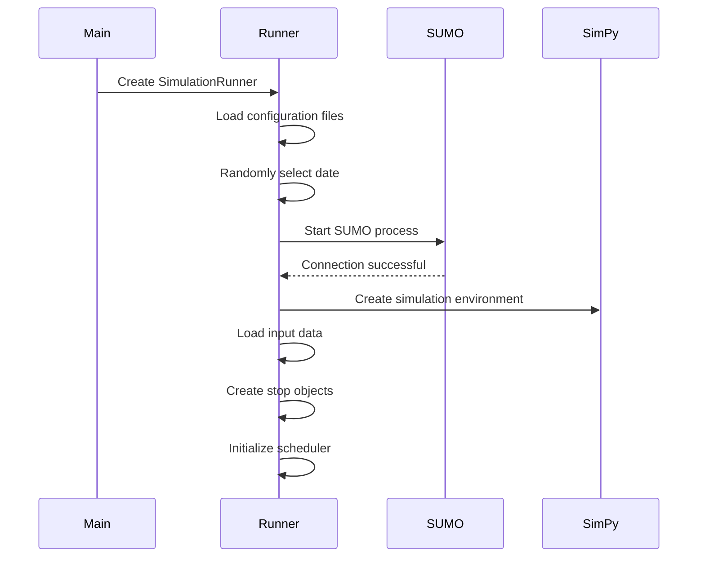

# Bus Simulator Technical Documentation

## Table of Contents

1. [System Overview](#1-system-overview)
2. [Architecture Design](#2-architecture-design)
3. [Core Component Details](#3-core-component-details)
4. [Runtime Flow Analysis](#4-runtime-flow-analysis)
5. [Scheduling Algorithm Implementation](#5-scheduling-algorithm-implementation)
6. [Data Flow and Event Handling](#6-data-flow-and-event-handling)
7. [Performance Optimization and Scalability](#7-performance-optimization-and-scalability)
8. [Technical Implementation Details](#8-technical-implementation-details)
9. [System Integration and Deployment](#9-system-integration-and-deployment)
10. [Appendix](#10-appendix)

---

## 1. System Overview

### 1.1 System Positioning

This bus simulator is a hybrid system based on Discrete Event Simulation (DES) and microscopic traffic simulation, aimed at:
- Accurately simulating bus system operations
- Evaluating the effectiveness of different scheduling strategies
- Supporting data-driven optimization for operational decisions
- Providing an extensible simulation platform

### 1.2 Technology Stack

- **Simulation Engine**: SimPy 4.x (Discrete Events) + SUMO (Traffic Simulation)
- **Programming Language**: Python 3.8+
- **Data Processing**: Apache Spark (Streaming ETL)
- **Data Storage**: SQL Server
- **Interface Protocol**: libsumo (Python-SUMO binding)

### 1.3 Key Features

1. **Collaborative Simulation**: Clock synchronization mechanism between SimPy and SUMO
2. **Multiple Scheduling Strategies**: Support for timetable, fixed-interval, adaptive and other scheduling algorithms
3. **Real-time Data Collection**: Event-driven data collection and streaming processing
4. **Performance Optimization**: Using libsumo instead of TraCI, providing 5-10x performance improvement

---

## 2. Architecture Design

### 2.1 Layered Architecture

The system adopts a five-layer architecture design:

```
┌─────────────────────────────────────────────┐
│           Main Control Layer                 │
│         SimulationRunner Coordinator         │
└─────────────────────────────────────────────┘
                      ↓
┌─────────────────────────────────────────────┐
│          Scheduling Layer                    │
│   Scheduler Interface + Multiple Strategy    │
│             Implementations                  │
└─────────────────────────────────────────────┘
                      ↓
┌─────────────────────────────────────────────┐
│            Entity Layer                      │
│      Bus, BusStop, Passenger Entities       │
└─────────────────────────────────────────────┘
                      ↓
┌─────────────────────────────────────────────┐
│        Infrastructure Layer                  │
│    SimPy Environment, SUMO Engine,           │
│           Event Handlers                     │
└─────────────────────────────────────────────┘
                      ↓
┌─────────────────────────────────────────────┐
│           Data Layer                         │
│     Input Data, Real-time Events,           │
│           Output Storage                     │
└─────────────────────────────────────────────┘
```

### 2.2 Inter-Component Communication

1. **Synchronization Mechanism**:
   - SimPy acts as the main clock, SUMO follows
   - Synchronizes every simulation time step (1 second)
   - Uses coroutines to ensure non-blocking execution

2. **Event Transmission**:
   - Based on publish-subscribe pattern
   - EventHandler serves as event bus
   - Supports asynchronous event processing

3. **Data Flow**:
   - Input: JSON configuration files → Memory objects
   - Runtime: Events → DataHook → File buffering
   - Output: Buffer files → Spark ETL → Database

---

## 3. Core Component Details

### 3.1 SimulationRunner (Main Controller)

**Responsibilities**:
- Initialize simulation environment
- Coordinate SimPy and SUMO execution
- Manage simulation lifecycle

**Key Methods**:

```python
class SimulationRunner:
    def __init__(self, config_path: str, scenario_name: str):
        # Load configuration
        # Initialize SimPy environment
        # Set random seed
        
    def setup(self) -> bool:
        # Start SUMO
        # Load data
        # Create stops and schedulers
        # Calculate passenger generation start time
        
    def run(self):
        # Main simulation loop
        # Clock synchronization
        # Event processing
        # State updates
```

**Time Management Strategy**:
- Supports non-zero start time (e.g., 18000 seconds = 5:00 AM)
- Dynamically calculates passenger generation start time
- Handles cross-day scenarios (0-86400 seconds cycle)

### 3.2 Bus (Bus Entity)

**State Machine**:
```
Idle → EnRoute → Dwelling → EnRoute → ... → Finished
         ↑_____________________↓
```

**Core Attributes**:
- `bus_id`: Unique identifier
- `route_stops`: Route stop sequence
- `current_capacity_load`: Current passenger load
- `passengers`: Passenger list
- `stop_schedules`: Stop timetable

**Key Processes**:

```python
def handle_sumo_stop_arrival(self, stop_id: str):
    # SUMO event-triggered stop arrival handling
    # Record actual arrival time
    # Calculate deviation
    # Start boarding/alighting coroutine
    
def _process_stop_arrival(self, bus_stop: BusStop, stop_id: str):
    # Parallel processing of boarding/alighting
    # Calculate dwell time
    # Execute control strategy (e.g., Holding)
    # Update SUMO stop time
```

**Capacity Management**:
- Total capacity: BUS_CAPACITY (default 75, defined in simulation/config.py line 18)
- Wheelchair spaces: MAX_DISABLED_PASSENGERS_PER_BUS (default 1, defined in simulation/config.py line 19)
- Capacity cost: Regular passengers 1, wheelchair passengers 2

**Vehicle Dynamics Parameters**:
- Vehicle physical characteristics (acceleration, deceleration, maximum speed) are defined in `{scenario_name}/SUMO/vtypes.xml`
- The system reads these parameters from XML file at startup, ensuring SimPy and SUMO use consistent values
- Example XML configuration:
  ```xml
  <vType id="bus" accel="1.0" decel="1.0" maxSpeed="15" />
  ```

**Capacity Parameter Hierarchy**:
- **Base Default Value**: `BUS_CAPACITY = 75` defined in `simulation/config.py`
- **Scheduler-Specific Configuration**: Can redefine `bus_capacity: 75` for specific schedulers (like adaptive_headway) in `config.yml`
- **Runtime Usage**: Scheduler prioritizes values from config.yml, falling back to config.py defaults if undefined

### 3.3 BusStop (Bus Stop)

**Passenger Generation Model**:
- Based on Poisson process
- Parameter λ obtained from historical data
- Considers factors like time period, month, weekday

```python
def generate_passengers(self):
    while True:
        # Get arrival rate λ for current time period
        lambda_ = get_arrival_rate(...)
        
        # Calculate next passenger arrival time
        inter_arrival_time = random.expovariate(lambda_per_second)
        
        # Generate passenger attributes
        # - Destination (based on OD matrix)
        # - Disability status (probability model)
        # - Intended route
```

**Boarding/Alighting Processing**:
- Parallel execution of boarding and alighting processes
- Alighting time: REGULAR_ALIGHTING_TIME (1.0s), DISABLED_ALIGHTING_TIME (45.0s)
- Boarding time: REGULAR_BOARDING_TIME (2.0s), DISABLED_BOARDING_TIME (45.0s)
- Disabled passengers require longer operation time

### 3.4 Scheduler Interface

**Base Class Definition**:

```python
class SchedulerInterface(ABC):
    @abstractmethod
    def schedule_route(self, route_id: str, ...):
        """Main method for route scheduling"""
        
    @abstractmethod
    def get_next_departure_time(self, route_id: str) -> float:
        """Get next bus departure time"""
```

**Implementation Types**:

1. **TimetableScheduler**:
   - Strictly follows predetermined timetable
   - Supports skipping delayed trips
   - Suitable for low-frequency routes

2. **IntervalScheduler**:
   - Fixed departure intervals
   - Distinguishes peak/off-peak periods
   - Suitable for high-frequency routes

3. **AdaptiveScheduler**:
   - Adjusts based on real-time passenger flow
   - Uses sliding window prediction
   - Balances waiting time and load factor

4. **AdaptiveHeadwayScheduler**:
   - Monitors key stop demand
   - Dynamically calculates optimal headway
   - Implements headway control

### 3.5 Event Handling System

**EventHandler Responsibilities**:
- Centrally manage all system events
- Avoid circular dependencies
- Support data collection and KPI calculation

**Event Types**:
```python
EVENT_TYPES = [
    'bus_arrival',         # Bus arrival
    'bus_departure',       # Bus departure
    'bus_dispatch',        # Bus dispatch
    'passenger_arrival',   # Passenger arrival
    'passenger_boarded',   # Passenger boarded
    'passenger_alighted',  # Passenger alighted
    'passenger_denied',    # Boarding denied
    'bus_failure',         # Vehicle failure
    'headway_adjust'       # Headway adjustment
]
```

---

## 4. Runtime Flow Analysis

### 4.1 Initialization Phase



### 4.2 Main Simulation Loop

```python
def run(self):
    while simulation_time < end_time:
        # 1. SUMO step
        traci.simulationStep()
        current_sumo_time = traci.simulation.getTime()
        
        # 2. SimPy synchronization
        if self.env.now < current_sumo_time:
            self.env.run(until=current_sumo_time)
            
        # 3. Process SUMO events
        results = traci.simulation.getSubscriptionResults()
        self.process_sumo_events(results, bus_map)
        
        # 4. Update system state
        simulation_time = current_sumo_time
```

### 4.3 Bus Lifecycle

1. **Dispatch Phase**:
   - Scheduler determines departure time
   - Create vehicle in SUMO
   - Initialize Bus object
   - Start running coroutine

2. **Operation Phase**:
   - SUMO controls vehicle movement
   - Trigger stop events upon arrival
   - SimPy processes passenger interactions
   - Update stop times

3. **Termination Phase**:
   - Arrive at terminal stop
   - All passengers alight
   - Remove vehicle from SUMO
   - Record operation data

### 4.4 Passenger Behavior Model

```python
# Passenger generation
arrival_time → origin_stop → destination_stop → intended_route

# Boarding decision
if destination in remaining_stops and has_capacity:
    board()
else:
    if random() < REQUEUE_PROPORTION:
        requeue()
    else:
        leave_system()

# Alighting logic
if current_stop == destination or is_final_stop:
    alight()
```

---

## 5. Scheduling Algorithm Implementation

### 5.1 Adaptive Headway Algorithm

**Core Formula**:
```
h* = max(h_min, min(h_max, (β* × C) / (Σλ̂/n)))
```

**Parameter Description**:
- `h*`: Target departure headway (seconds)
- `h_min/h_max`: Minimum/maximum headway limits
- `β*`: Target load factor (0.7-1.0)
- `C`: Vehicle capacity
- `Σλ̂`: Total demand rate at monitored stops
- `n`: Number of monitored stops

**Implementation Details**:

```python
def _calculate_target_headway(self, current_time: float) -> float:
    # 1. Get monitored stops
    monitored_stops = self.MONITORED_STOPS[self.route_id]
    
    # 2. Predict demand
    total_demand_rate = 0.0
    for stop_id in monitored_stops:
        demand_rate = self.demand_predictor.get_arrival_rate(
            stop_id, current_time
        )
        total_demand_rate += demand_rate
    
    # 3. Calculate average demand rate
    avg_demand_rate = total_demand_rate / len(monitored_stops)
    
    # 4. Apply formula
    if avg_demand_rate < 0.001:
        target_headway = self.h_max
    else:
        target_headway = (self.beta_target * self.capacity) / avg_demand_rate
        
    # 5. Apply constraints
    return max(self.h_min, min(self.h_max, target_headway))
```

### 5.2 Headway Control (Holding Strategy)

**Purpose**: Prevent bus bunching and maintain uniform spacing

**Implementation Conditions**:
- Vehicle arrives early (ahead of planned interval)
- Deviation exceeds tolerance threshold
- Does not exceed maximum control time

```python
def _calculate_hold_time_for_fixed_headway(self, bus_id: str, current_time: float):
    # Find preceding bus
    preceding_bus = self._find_preceding_bus(bus_id)
    
    # Calculate actual headway
    time_since_preceding = current_time - preceding_state['departure_time']
    
    # If early relative to fixed headway, calculate hold time
    if time_since_preceding < fixed_headway:
        hold_time = min(self.max_hold, fixed_headway - time_since_preceding)
        return hold_time if hold_time > fixed_headway * 0.05 else None
    
    return None
```

### 5.3 Demand Prediction Model

**Poisson Demand Predictor**:

```python
class PoissonDemandPredictor:
    def get_arrival_rate(self, stop_id: str, current_time: float) -> float:
        # 1. Determine time period
        period = self._get_time_period(current_time)
        
        # 2. Query historical data
        historical_rate = self._lookup_historical_rate(
            stop_id, self.month, self.day, period
        )
        
        # 3. Apply correction factors
        # - Weather impact
        # - Special events
        # - Trend adjustment
        
        return adjusted_rate
```

---

## 6. Data Flow and Event Handling

### 6.1 Input Data Structure

**1. Arrival Rate Data** (`arrival_rate.json`):
```json
{
  "601001": {
    "9769": {
      "month_1": {
        "weekday_1": {
          "morning_peak": 45.2,
          "midday": 22.8,
          "evening_peak": 38.5,
          "night": 8.3
        }
      }
    }
  }
}
```

**2. OD Weight Matrix** (`weights.json`):
```json
{
  "601001": {
    "month_1": {
      "weekday_1": {
        "morning_peak": [0.0, 0.15, 0.25, 0.35, ...]
      }
    }
  }
}
```

**3. Stop Mapping** (`stop_mapping.json`):
```json
{
  "simpy_to_sumo": {
    "northbound": {
      "9769": "busStop_N1",
      "9770": "busStop_N2"
    },
    "southbound": {
      "9809": "busStop_S1",
      "9810": "busStop_S2"
    }
  }
}
```

### 6.2 Real-time Event Processing

**Event Pipeline**:
```
Event Occurrence → EventHandler.record_event() → Event Distribution
    ↓
Data Collection Hooks → Buffer Writing → Batch Output
    ↓
Spark Streaming → Transform Processing → Database Storage
```

**Key Event Data**:

```python
# Bus arrival event
{
    'event_type': 'bus_arrival',
    'time': 23456.0,
    'details': {
        'bus_id': 'bus_601001_1',
        'stop_id': '9769',
        'scheduled_time': 23400.0,
        'actual_time': 23456.0,
        'deviation': 56.0,
        'load': 35,
        'disabled_count': 1
    }
}

# Passenger boarding event
{
    'event_type': 'passenger_boarded',
    'time': 23460.0,
    'details': {
        'passenger_id': 12345,
        'bus_id': 'bus_601001_1',
        'stop_id': '9769',
        'destination': '9775',
        'wait_time': 180.5,
        'is_disabled': false
    }
}
```

### 6.3 Data Collection Hooks

**SimPyDataHook Implementation**:

```python
class SimPyDataHook:
    def __init__(self, output_dir: str, batch_size: int = 500):
        self.buffer = []
        self.batch_size = batch_size
        self.file_counter = 0
        
    def on_bus_arrival(self, **kwargs):
        # Build record
        record = self._build_trip_record(**kwargs)
        
        # Add to buffer
        self.buffer.append(record)
        
        # Batch write
        if len(self.buffer) >= self.batch_size:
            self._flush_buffer()
            
    def _flush_buffer(self):
        # Generate filename (with timestamp)
        filename = f"events_{self.file_counter}_{timestamp}.json"
        
        # Atomic write
        with open(temp_file, 'w') as f:
            json.dump(self.buffer, f)
        os.rename(temp_file, final_file)
        
        self.buffer.clear()
        self.file_counter += 1
```

### 6.4 ETL Processing Flow

**Spark Streaming Job**:

```python
class BusTripETL:
    def run_streaming(self, input_dir: str):
        # 1. Create streaming DataFrame
        df = spark.readStream \
            .schema(self.schema) \
            .json(input_dir)
            
        # 2. Transform processing
        processed_df = df \
            .withColumn("OPD_DATE", to_date(col("simulation_date"))) \
            .withColumn("WEEKDAY", date_format(col("OPD_DATE"), 'E')) \
            .withColumn("SIGNID", concat(
                col("OPD_DATE"), lit("_"),
                col("bus_id"), lit("_"),
                col("stop_id")
            ))
            
        # 3. Write to database
        query = processed_df.writeStream \
            .foreachBatch(self._write_to_database) \
            .trigger(processingTime='10 seconds') \
            .start()
```

---

## 7. Performance Optimization and Scalability

### 7.1 Performance Optimization Strategies

**1. Use libsumo instead of TraCI**:
- Eliminate network communication overhead
- Direct memory access
- 5-10x performance improvement

**2. Event Batching**:
- Buffer mechanism reduces I/O
- Batch database writes
- Asynchronous event processing

**3. Parallel Processing**:
- Parallel execution of boarding/alighting processes
- Independent scheduling for multiple routes
- Spark parallel ETL

**4. Memory Optimization**:
- Use generators to avoid large lists
- Timely cleanup of completed entities
- Limit historical data window

### 7.2 Scalability Design

**1. Scheduler Pluggability**:
```python
# Add new scheduler
class CustomScheduler(SchedulerInterface):
    def schedule_route(self, ...):
        # Custom implementation
        
# Register for use
scheduler_registry['custom'] = CustomScheduler
```

**2. Event Handler Extension**:
```python
# Add custom event handling
event_handler.register_handler('custom_event', custom_handler)
```

**3. Data Source Adaptation**:
- Support multiple input formats
- Configurable data loaders
- Reserved real-time data interfaces

### 7.3 Reliability Assurance

**1. Error Handling**:
- Layered exception capturing
- Graceful degradation strategies
- Detailed error logging

**2. State Recovery**:
- Regular checkpoints
- Event replay mechanism
- Partial failure handling

**3. Monitoring and Alerting**:
- Real-time KPI monitoring
- Anomaly detection
- Performance metric tracking

---

## 8. Technical Implementation Details

### 8.1 Clock Synchronization Mechanism

**Problem**: SimPy and SUMO each have independent clocks, requiring precise synchronization

**Solution**:
```python
# Synchronization logic in main loop
while simulation_time < end_time:
    # 1. SUMO steps forward
    traci.simulationStep()
    sumo_time = traci.simulation.getTime()
    
    # 2. SimPy catches up
    if self.env.now < sumo_time:
        self.env.run(until=sumo_time)
    
    # 3. Process accumulated events
    # This ensures all SimPy events trigger at correct time
```

### 8.2 Stop Detection Optimization

**Original Method Issues**:
- Polling detection is inefficient
- May miss brief stops

**Optimization Approach**:
```python
# Use SUMO's stop state subscription
if hasattr(traci.constants, 'VAR_STOP_STATE'):
    sub_vars.append(traci.constants.VAR_STOP_STATE)
    
# Precise stop detection
stop_state = traci.vehicle.getStopState(bus_id)
is_at_stop = (stop_state & 1) != 0  # Check bit-0
```

### 8.3 Dynamic Route Handling

**Scenario**: Some stops may be temporarily closed or adjusted

**Implementation**:
```python
# Dynamically update stop sequence
def update_route_stops(self, bus_id: str, new_stops: List[str]):
    bus = self.get_bus(bus_id)
    
    # Keep stops already passed
    passed_stops = bus.route_stops[:bus.current_stop_index]
    
    # Update subsequent stops
    bus.route_stops = passed_stops + new_stops
    
    # Notify SUMO to update
    self._update_sumo_stops(bus_id, new_stops)
```

### 8.4 Memory Leak Protection

**Potential Issue**: Long-running simulations may accumulate large amounts of historical data

**Protection Measures**:
```python
# 1. Use limited capacity data structures
self.travel_times = defaultdict(lambda: deque(maxlen=20))

# 2. Periodically clean up completed entities
if bus.state == "Finished":
    self.active_buses.remove(bus)
    del self.bus_states[bus.bus_id]
    
# 3. Event log rotation
if len(self.event_log) > MAX_EVENTS:
    self.archive_old_events()
```

### 8.5 Vehicle Parameter Synchronization

**Problem**: Ensure SimPy and SUMO use the same vehicle dynamics parameters

**Solution**:
```python
# Read vehicle parameters from SUMO configuration file
def _load_bus_dynamics(vtypes_path: Path) -> tuple[float, float, float]:
    """Parse vehicle dynamics parameters from vtypes.xml"""
    tree = ET.parse(vtypes_path)
    root = tree.getroot()
    bus_elem = root.find(".//vType[@id='bus']")
    
    accel = float(bus_elem.get("accel", "1.0"))
    decel = float(bus_elem.get("decel", "1.0"))
    max_speed = float(bus_elem.get("maxSpeed", "15"))
    
    return accel, decel, max_speed

# Use read parameters for travel time calculation
def calculate_travel_time(distance: float, accel: float, decel: float, max_speed: float):
    # Ensure time calculation in SimPy matches SUMO's physical model
    ...
```

**Configuration File Locations**:
- Vehicle type definitions for each scenario: `{scenario_name}/SUMO/vtypes.xml`
- Referenced in SUMO configuration file: `{scenario_name}/SUMO/simulation.sumocfg`

---

## 9. System Integration and Deployment

### 9.1 Environment Setup

**Dependency Installation**:
```bash
# Python environment
pip install simpy==4.0.1
pip install sumolib==1.14.1
pip install pyspark==3.3.0
pip install pyodbc==4.0.35

# SUMO installation
apt-get install sumo sumo-tools

# SQL Server ODBC driver
curl https://packages.microsoft.com/keys/microsoft.asc | apt-key add -
curl https://packages.microsoft.com/config/ubuntu/20.04/prod.list > /etc/apt/sources.list.d/mssql-release.list
apt-get update
apt-get install msodbcsql17
```

### 9.2 Configuration Management

**Main Configuration File Structure**:
```yaml
simulation:
  start_time_seconds: 18000      # 5:00 AM
  end_time_seconds: 86400        # 24:00
  random_seed: 42
  num_rounds: 10

simpy:
  scheduler:
    type: adaptive_headway
    adaptive_headway:
      beta_target: 1.0
      h_min: 600
      h_max: 1800
      monitored_stops:
        601001: ['9769', '9770', '9723']
        601002: ['9819', '9883']

paths:
  simpy_data:
    arrival_rates_file: '{scenario_name}/trail/arrival_rate.json'
  sumo_scenario:
    config_file: '{scenario_name}/SUMO/simulation.sumocfg'
```

### 9.3 Runtime Modes

**1. Single Simulation**:
```bash
python run_simulation_simple.py --scenario 601
```

**2. Batch Comparison Experiments**:
```bash
# Baseline scenario
python run_simulation.py --scenario 601 --scheduler timetable --output baseline

# Test scenario  
python run_simulation.py --scenario 601 --scheduler adaptive_headway --output test

# Result analysis
python analyze_results.py --baseline baseline --test test
```

**3. Real-time Monitoring Mode**:
```bash
# Start simulation (with monitoring interface)
python run_simulation.py --enable-monitoring --port 8080

# View real-time status in another terminal
curl http://localhost:8080/api/status
curl http://localhost:8080/api/kpi
```

### 9.4 Performance Tuning

**1. JVM Tuning (For Spark)**:
```bash
export SPARK_DRIVER_MEMORY=4g
export SPARK_EXECUTOR_MEMORY=2g
export SPARK_DRIVER_MAXRESULTSIZE=2g
```

**2. Python Optimization**:
```python
# Use PyPy instead of CPython
pypy3 run_simulation.py

# Or use Numba to accelerate critical functions
from numba import jit

@jit
def calculate_travel_time(distance, accel, decel, max_speed):
    # Computation-intensive function
```

**3. Database Optimization**:
```sql
-- Create indexes to speed up queries
CREATE INDEX IX_BusTrip_TimeRange 
ON BusTrip(OPD_DATE, ACT_ARR_TIME);

-- Partition tables to improve performance
CREATE PARTITION FUNCTION PF_Date (DATE)
AS RANGE RIGHT FOR VALUES ('2024-01-01', '2024-02-01', ...);
```

---

## 10. Appendix

### 10.1 Key Parameter Reference

| Parameter Category | Parameter Name | Default Value | Description | Configuration Location |
|-------------------|----------------|---------------|-------------|----------------------|
| Vehicle | BUS_CAPACITY | 75 | Total passenger capacity | simulation/config.py:18 |
| Vehicle | MAX_DISABLED_PASSENGERS_PER_BUS | 1 | Number of wheelchair spaces | simulation/config.py:19 |
| Vehicle | accel | 1.0 m/s² | Acceleration | 601/SUMO/vtypes.xml |
| Vehicle | decel | 1.0 m/s² | Deceleration | 601/SUMO/vtypes.xml |
| Vehicle | maxSpeed | 15 m/s | Maximum speed | 601/SUMO/vtypes.xml |
| Passenger | DISABLED_PASSENGER_PROBABILITY | 0.01 | Disabled passenger ratio | simulation/config.py:21 |
| Passenger | REGULAR_BOARDING_TIME | 2.0s | Regular boarding time | simulation/config.py:9 |
| Passenger | DISABLED_BOARDING_TIME | 45.0s | Wheelchair boarding time | simulation/config.py:10 |
| Scheduling | DISPATCH_INTERVAL_SECONDS | 1800s | Default dispatch interval | simulation/config.py:25 |
| Scheduling | OTP_WINDOW | ±180s | On-time performance window | config.yml |
